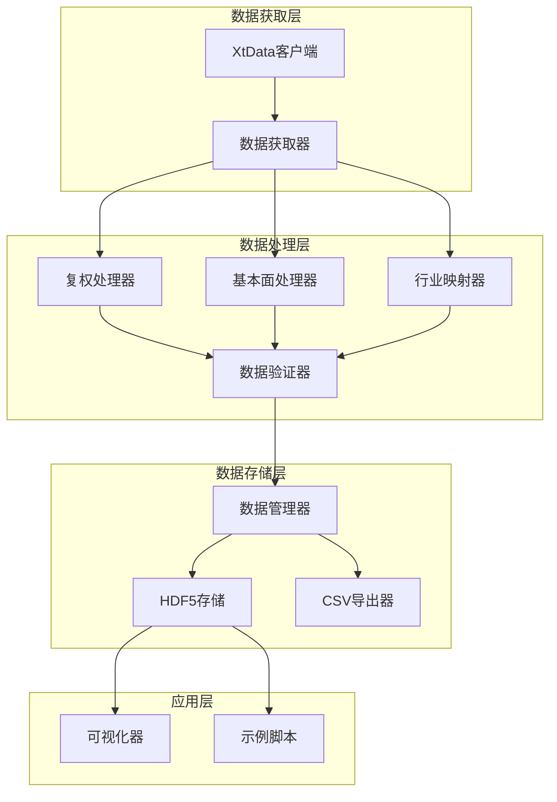

# 设计文档：第二周 - XtData金融数据工程

## 概述

本设计文档描述了Week 2金融数据工程系统的技术架构和实现方法。该系统是一个教学导向的金融数据处理框架，专注于从XtData API获取、处理、存储和可视化中国市场数据。

核心设计目标：
1. **教学清晰性**：代码结构清晰，易于理解金融数据工程概念
2. **时间点正确性**：严格防止未来函数，确保回测的真实性
3. **增量高效性**：支持增量更新，最小化API调用和存储开销
4. **数据完整性**：提供完整的数据质量检查和错误处理机制

系统采用模块化设计，每个模块对应一个核心功能领域，便于学习者逐步掌握金融数据工程的各个方面。

## 架构

### 系统架构图



### 架构层次

1. **数据获取层**：封装XtData API调用，提供统一的数据获取接口
2. **数据处理层**：实现复权、基本面处理、行业映射和数据验证
3. **数据存储层**：管理本地数据持久化和增量更新
4. **应用层**：提供可视化和示例脚本供学习使用

### 设计原则

- **单一职责**：每个模块专注于一个核心功能
- **依赖注入**：通过构造函数注入依赖，便于测试
- **配置驱动**：使用配置文件管理API密钥、存储路径等
- **错误透明**：详细的错误消息和日志，便于调试学习

## 组件和接口

### 1. XtData客户端 (XtDataClient)

封装XtData API的底层调用，处理认证和连接管理。

```python
class XtDataClient:
    """XtData API客户端封装"""
    
    def __init__(self, account_id: str, account_key: str):
        """
        初始化XtData客户端
        
        Args:
            account_id: XtData账户ID
            account_key: XtData账户密钥
        """
        pass
    
    def connect(self) -> bool:
        """
        连接到XtData服务
        
        Returns:
            连接是否成功
        """
        pass
    
    def disconnect(self) -> None:
        """断开XtData连接"""
        pass
    
    def is_connected(self) -> bool:
        """检查连接状态"""
        pass
```

### 2. 数据获取器 (DataRetriever)

提供高级数据获取接口，支持历史数据和实时数据。

```python
from typing import List, Optional
import pandas as pd
from datetime import datetime

class DataRetriever:
    """市场数据获取器"""
    
    def __init__(self, client: XtDataClient):
        """
        初始化数据获取器
        
        Args:
            client: XtData客户端实例
        """
        self.client = client
    
    def download_history_data(
        self,
        stock_codes: List[str],
        start_date: str,
        end_date: str,
        period: str = '1d',
        adjust_type: str = 'none'
    ) -> pd.DataFrame:
        """
        下载历史市场数据
        
        Args:
            stock_codes: 股票代码列表，如 ['000001.SZ', '600000.SH']
            start_date: 开始日期，格式 'YYYYMMDD'
            end_date: 结束日期，格式 'YYYYMMDD'
            period: 数据周期，'tick' 或 '1d'
            adjust_type: 复权类型，'none', 'front', 'back'
        
        Returns:
            包含OHLCV数据的DataFrame
            
        Raises:
            ConnectionError: API连接失败
            ValueError: 参数无效
        """
        pass
    
    def get_market_data(
        self,
        stock_codes: List[str]
    ) -> pd.DataFrame:
        """
        获取当前市场快照数据
        
        Args:
            stock_codes: 股票代码列表
        
        Returns:
            包含当前市场数据的DataFrame
        """
        pass
    
    def get_all_stock_codes(self) -> List[str]:
        """
        获取所有可用的股票代码
        
        Returns:
            股票代码列表
        """
        pass
```

### 3. 复权处理器 (PriceAdjuster)

实现前复权和后复权算法。

```python
class PriceAdjuster:
    """价格复权处理器"""
    
    def __init__(self, client: XtDataClient):
        """
        初始化复权处理器
        
        Args:
            client: XtData客户端，用于获取复权因子
        """
        self.client = client
    
    def forward_adjust(
        self,
        data: pd.DataFrame,
        stock_code: str
    ) -> pd.DataFrame:
        """
        前复权：从分红送股事件向前调整价格
        
        用于回测场景，避免未来函数。在每个历史时点，
        使用该时点之前的复权因子调整更早的价格。
        
        Args:
            data: 原始价格数据，包含OHLCV列
            stock_code: 股票代码
        
        Returns:
            前复权后的数据
        """
        pass
    
    def backward_adjust(
        self,
        data: pd.DataFrame,
        stock_code: str
    ) -> pd.DataFrame:
        """
        后复权：从当前价格向后调整历史价格
        
        用于展示场景，保持当前价格不变。
        
        Args:
            data: 原始价格数据，包含OHLCV列
            stock_code: 股票代码
        
        Returns:
            后复权后的数据
        """
        pass
    
    def get_adjust_factors(
        self,
        stock_code: str,
        start_date: str,
        end_date: str
    ) -> pd.DataFrame:
        """
        获取复权因子
        
        Args:
            stock_code: 股票代码
            start_date: 开始日期
            end_date: 结束日期
        
        Returns:
            包含日期和复权因子的DataFrame
        """
        pass
```

### 4. 基本面数据处理器 (FundamentalHandler)

处理财务指标数据，确保时间点正确性。

```python
class FundamentalHandler:
    """基本面数据处理器"""
    
    def __init__(self, client: XtDataClient):
        """
        初始化基本面处理器
        
        Args:
            client: XtData客户端
        """
        self.client = client
    
    def get_financial_data(
        self,
        stock_codes: List[str],
        indicators: List[str],
        as_of_date: str
    ) -> pd.DataFrame:
        """
        获取指定时点的财务数据（时间点正确）
        
        Args:
            stock_codes: 股票代码列表
            indicators: 指标列表，如 ['pe', 'pb', 'roe']
            as_of_date: 查询时点，格式 'YYYYMMDD'
        
        Returns:
            包含财务指标的DataFrame，仅包含as_of_date之前公告的数据
        """
        pass
    
    def calculate_pe_ratio(
        self,
        stock_code: str,
        date: str,
        price_data: pd.DataFrame
    ) -> Optional[float]:
        """
        计算PE比率（市盈率）
        
        Args:
            stock_code: 股票代码
            date: 计算日期
            price_data: 价格数据
        
        Returns:
            PE比率，如果数据不可用则返回None
        """
        pass
    
    def calculate_pb_ratio(
        self,
        stock_code: str,
        date: str,
        price_data: pd.DataFrame
    ) -> Optional[float]:
        """
        计算PB比率（市净率）
        
        Args:
            stock_code: 股票代码
            date: 计算日期
            price_data: 价格数据
        
        Returns:
            PB比率，如果数据不可用则返回None
        """
        pass
```

### 5. 行业映射器 (IndustryMapper)

管理申万行业分类和股票-行业映射关系。

```python
class IndustryMapper:
    """行业分类映射器"""
    
    def __init__(self, client: XtDataClient):
        """
        初始化行业映射器
        
        Args:
            client: XtData客户端
        """
        self.client = client
        self._industry_cache = {}
    
    def get_industry_structure(self) -> dict:
        """
        获取申万行业分类层级结构
        
        Returns:
            行业层级字典，包含一级、二级、三级行业
        """
        pass
    
    def get_stock_industry(
        self,
        stock_code: str,
        date: Optional[str] = None
    ) -> dict:
        """
        获取股票的行业分类
        
        Args:
            stock_code: 股票代码
            date: 查询日期，None表示当前
        
        Returns:
            包含各级行业代码和名称的字典
        """
        pass
    
    def get_industry_constituents(
        self,
        industry_code: str,
        date: Optional[str] = None
    ) -> List[str]:
        """
        获取行业成分股
        
        Args:
            industry_code: 行业代码
            date: 查询日期，None表示当前
        
        Returns:
            股票代码列表
        """
        pass
```

### 6. 数据管理器 (DataManager)

管理本地数据存储和增量更新。

```python
class DataManager:
    """数据持久化管理器"""
    
    def __init__(self, storage_path: str):
        """
        初始化数据管理器
        
        Args:
            storage_path: 数据存储根目录
        """
        self.storage_path = storage_path
        self.hdf5_path = os.path.join(storage_path, 'market_data.h5')
    
    def save_market_data(
        self,
        data: pd.DataFrame,
        data_type: str,
        stock_code: Optional[str] = None
    ) -> None:
        """
        保存市场数据到HDF5
        
        Args:
            data: 要保存的数据
            data_type: 数据类型，如 'daily', 'tick', 'fundamental'
            stock_code: 股票代码，None表示全市场数据
        """
        pass
    
    def load_market_data(
        self,
        data_type: str,
        stock_code: Optional[str] = None,
        start_date: Optional[str] = None,
        end_date: Optional[str] = None
    ) -> pd.DataFrame:
        """
        从HDF5加载市场数据
        
        Args:
            data_type: 数据类型
            stock_code: 股票代码，None表示全市场
            start_date: 开始日期
            end_date: 结束日期
        
        Returns:
            市场数据DataFrame
        """
        pass
    
    def get_last_update_date(
        self,
        data_type: str,
        stock_code: Optional[str] = None
    ) -> Optional[str]:
        """
        获取最后更新日期
        
        Args:
            data_type: 数据类型
            stock_code: 股票代码
        
        Returns:
            最后更新日期，格式 'YYYYMMDD'，如果没有数据则返回None
        """
        pass
    
    def incremental_update(
        self,
        retriever: DataRetriever,
        stock_codes: List[str],
        data_type: str = 'daily'
    ) -> int:
        """
        增量更新市场数据
        
        Args:
            retriever: 数据获取器实例
            stock_codes: 要更新的股票代码列表
            data_type: 数据类型
        
        Returns:
            更新的记录数
        """
        pass
    
    def export_to_csv(
        self,
        data_type: str,
        output_path: str,
        stock_code: Optional[str] = None
    ) -> None:
        """
        导出数据到CSV
        
        Args:
            data_type: 数据类型
            output_path: 输出文件路径
            stock_code: 股票代码
        """
        pass
```

### 7. 可视化器 (Visualizer)

生成金融图表和技术分析可视化。

```python
import matplotlib.pyplot as plt

class Visualizer:
    """金融数据可视化器"""
    
    def __init__(self, style: str = 'default'):
        """
        初始化可视化器
        
        Args:
            style: matplotlib样式
        """
        plt.style.use(style)
    
    def plot_kline(
        self,
        data: pd.DataFrame,
        stock_code: str,
        ma_periods: Optional[List[int]] = None,
        save_path: Optional[str] = None
    ) -> None:
        """
        绘制K线图
        
        Args:
            data: 包含OHLCV的DataFrame
            stock_code: 股票代码（用于标题）
            ma_periods: 移动平均线周期列表，如 [5, 10, 20]
            save_path: 保存路径，None表示显示不保存
        """
        pass
    
    def plot_volume(
        self,
        data: pd.DataFrame,
        ax: Optional[plt.Axes] = None
    ) -> plt.Axes:
        """
        绘制成交量柱状图
        
        Args:
            data: 包含volume列的DataFrame
            ax: matplotlib轴对象，None表示创建新图
        
        Returns:
            matplotlib轴对象
        """
        pass
    
    def plot_multiple_stocks(
        self,
        data_dict: dict,
        metric: str = 'close',
        save_path: Optional[str] = None
    ) -> None:
        """
        绘制多只股票对比图
        
        Args:
            data_dict: 股票代码到数据的映射
            metric: 要绘制的指标，如 'close', 'volume'
            save_path: 保存路径
        """
        pass
```

## 数据模型

### 市场数据模型

```python
# 日线数据结构
DailyData = pd.DataFrame({
    'stock_code': str,      # 股票代码
    'date': str,            # 交易日期 YYYYMMDD
    'open': float,          # 开盘价
    'high': float,          # 最高价
    'low': float,           # 最低价
    'close': float,         # 收盘价
    'volume': float,        # 成交量
    'amount': float,        # 成交额
    'adjust_factor': float  # 复权因子
})

# Tick数据结构
TickData = pd.DataFrame({
    'stock_code': str,      # 股票代码
    'timestamp': int,       # 时间戳（毫秒）
    'price': float,         # 成交价
    'volume': int,          # 成交量
    'bid_price': float,     # 买一价
    'ask_price': float,     # 卖一价
    'bid_volume': int,      # 买一量
    'ask_volume': int       # 卖一量
})
```

### 基本面数据模型

```python
# 财务指标数据结构
FundamentalData = pd.DataFrame({
    'stock_code': str,          # 股票代码
    'report_date': str,         # 报告期 YYYYMMDD
    'announce_date': str,       # 公告日期 YYYYMMDD（关键！）
    'pe_ratio': float,          # 市盈率
    'pb_ratio': float,          # 市净率
    'roe': float,               # 净资产收益率
    'revenue': float,           # 营业收入
    'net_profit': float,        # 净利润
    'total_assets': float,      # 总资产
    'total_equity': float       # 净资产
})
```

### 行业分类数据模型

```python
# 行业分类结构
IndustryClassification = {
    'level1': {
        'code': str,        # 一级行业代码
        'name': str,        # 一级行业名称
        'level2': [         # 二级行业列表
            {
                'code': str,
                'name': str,
                'level3': [  # 三级行业列表
                    {
                        'code': str,
                        'name': str
                    }
                ]
            }
        ]
    }
}

# 股票-行业映射
StockIndustryMapping = pd.DataFrame({
    'stock_code': str,          # 股票代码
    'effective_date': str,      # 生效日期
    'industry_l1_code': str,    # 一级行业代码
    'industry_l1_name': str,    # 一级行业名称
    'industry_l2_code': str,    # 二级行业代码
    'industry_l2_name': str,    # 二级行业名称
    'industry_l3_code': str,    # 三级行业代码
    'industry_l3_name': str     # 三级行业名称
})
```

### HDF5存储结构

```
market_data.h5
├── /daily                  # 日线数据
│   ├── /000001.SZ         # 按股票代码分组
│   ├── /000002.SZ
│   └── ...
├── /tick                   # Tick数据
│   ├── /000001.SZ
│   └── ...
├── /fundamental            # 基本面数据
│   ├── /000001.SZ
│   └── ...
├── /industry              # 行业数据
│   ├── /mapping           # 股票-行业映射
│   └── /structure         # 行业结构
└── /metadata              # 元数据
    ├── /update_log        # 更新日志
    └── /data_quality      # 数据质量报告
```


## 正确性属性

属性是一个特征或行为，应该在系统的所有有效执行中保持为真——本质上是关于系统应该做什么的形式化陈述。属性作为人类可读规范和机器可验证正确性保证之间的桥梁。

### 数据获取属性

**属性1：历史数据范围正确性**
*对于任何*有效的股票代码列表和日期范围，download_history_data返回的数据应该仅包含指定日期范围内的记录，且每个请求的股票代码都有对应的数据。
**验证需求：1.1**

**属性2：市场快照数据完整性**
*对于任何*有效的股票代码列表，get_market_data返回的数据应该包含所有请求股票的当前市场数据。
**验证需求：1.2**

**属性3：Tick数据时间精度**
*对于任何*tick级别的数据请求，返回的所有记录都应该包含timestamp字段，且精度至少到秒级别。
**验证需求：1.3**

**属性4：日线数据唯一性**
*对于任何*日线数据请求，每个股票代码和日期的组合应该最多只有一条记录。
**验证需求：1.4**

**属性5：API错误处理稳定性**
*对于任何*API连接失败的情况，系统应该返回包含错误描述的异常或错误对象，而不是崩溃或挂起。
**验证需求：1.5**

**属性6：批量请求完整性**
*对于任何*多个股票代码的批量请求，返回的数据应该包含所有请求的股票代码（除非某些代码无效）。
**验证需求：1.6**

### 价格复权属性

**属性7：前复权方向正确性**
*对于任何*包含分红送股事件的股票数据，前复权应该调整事件之前的历史价格，而保持事件之后的价格不变或向前调整。
**验证需求：2.1**

**属性8：后复权当前价格不变性**
*对于任何*股票数据，后复权应该保持最新交易日的收盘价不变。
**验证需求：2.2**

**属性9：OHLC相对关系不变性**
*对于任何*价格数据，复权后每个交易日应该保持：high >= max(open, close) >= min(open, close) >= low。
**验证需求：2.4, 2.5**

### 基本面数据属性

**属性10：时间点正确性**
*对于任何*查询日期和基本面数据请求，返回的所有数据记录的announce_date（公告日期）都应该小于或等于查询日期。
**验证需求：3.1, 3.6, 7.2**

**属性11：PE比率计算正确性**
*对于任何*有效的价格和盈利数据，计算的PE比率应该等于价格除以每股收益，且数据时间对齐正确。
**验证需求：3.2**

**属性12：PB比率计算正确性**
*对于任何*有效的价格和账面价值数据，计算的PB比率应该等于价格除以每股净资产。
**验证需求：3.3**

**属性13：基本面数据缺失处理**
*对于任何*基本面数据请求，当数据缺失或为空时，系统应该返回None或空值而不是抛出异常。
**验证需求：3.5**

### 行业分类属性

**属性14：行业成分股一致性**
*对于任何*行业代码，get_industry_constituents返回的所有股票，在get_stock_industry查询时都应该返回该行业代码。
**验证需求：4.3**

**属性15：历史行业分类时间点正确性**
*对于任何*股票代码和历史日期，get_stock_industry应该返回在该日期有效的行业分类（effective_date <= 查询日期）。
**验证需求：4.4, 4.5**

**属性16：行业查询方式一致性**
*对于任何*行业，按行业代码查询和按行业名称查询应该返回相同的成分股列表。
**验证需求：4.6**

### 数据持久化属性

**属性17：存储-加载往返一致性**
*对于任何*市场数据，保存到HDF5后再加载，应该得到与原始数据等价的DataFrame（列、数据类型、值都相同）。
**验证需求：5.1**

**属性18：增量更新仅获取新数据**
*对于任何*增量更新操作，系统应该仅请求最后更新日期之后的数据，而不是重新下载所有历史数据。
**验证需求：5.3**

**属性19：重复数据去重**
*对于任何*包含重复记录的数据更新，存储后查询相同的股票代码和日期组合应该只返回一条记录。
**验证需求：5.4**

**属性20：查询过滤正确性**
*对于任何*带有股票代码、日期范围和数据类型过滤条件的查询，返回的所有记录都应该满足所有指定的过滤条件。
**验证需求：5.7**

### 数据对齐属性

**属性21：保守日期对齐**
*对于任何*跨数据源的数据对齐操作，当存在日期不确定性时，系统应该使用较早的日期以避免使用未来信息。
**验证需求：7.5**

### 错误处理属性

**属性22：无效股票代码错误消息**
*对于任何*无效的股票代码，系统应该返回包含该股票代码的清晰错误消息。
**验证需求：9.1**

**属性23：数据异常标记**
*对于任何*包含异常值（如负价格、价格超出合理范围）的数据，系统应该标记这些记录或发出警告。
**验证需求：9.2**

**属性24：部分数据处理连续性**
*对于任何*API返回的部分不完整数据，系统应该处理有效部分并记录问题，而不是完全失败。
**验证需求：9.3**

**属性25：数据类型验证**
*对于任何*待存储的数据，如果包含错误的数据类型（如字符串出现在数值列），系统应该拒绝存储并返回验证错误。
**验证需求：9.4**

**属性26：数据缺口检测**
*对于任何*时间序列数据，如果存在缺失的交易日，系统应该能够检测并报告缺失的日期范围。
**验证需求：9.5**

### 代码质量属性

**属性27：公共API文档完整性**
*对于任何*公共类和函数，都应该包含描述其功能、参数和返回值的文档字符串。
**验证需求：10.1**

## 错误处理

### 错误分类

系统定义以下错误类别：

1. **连接错误** (ConnectionError)
   - API连接失败
   - 网络超时
   - 认证失败

2. **数据错误** (DataError)
   - 无效的股票代码
   - 数据格式错误
   - 数据缺失

3. **验证错误** (ValidationError)
   - 参数验证失败
   - 数据类型错误
   - 数据范围异常

4. **存储错误** (StorageError)
   - 文件系统错误
   - HDF5读写失败
   - 磁盘空间不足

### 错误处理策略

```python
# 自定义异常类
class XtDataError(Exception):
    """XtData系统基础异常"""
    pass

class ConnectionError(XtDataError):
    """API连接相关错误"""
    pass

class DataError(XtDataError):
    """数据相关错误"""
    pass

class ValidationError(XtDataError):
    """数据验证错误"""
    pass

class StorageError(XtDataError):
    """存储相关错误"""
    pass
```

### 错误处理原则

1. **快速失败**：参数验证在函数入口处进行，无效输入立即返回错误
2. **详细消息**：错误消息包含足够的上下文信息便于调试
3. **日志记录**：所有错误都记录到日志文件，包含时间戳和堆栈跟踪
4. **优雅降级**：部分数据失败不影响其他数据的处理
5. **用户友好**：教学场景下，错误消息应该指导用户如何修复问题

### 日志配置

```python
import logging

# 日志配置
logging.basicConfig(
    level=logging.INFO,
    format='%(asctime)s - %(name)s - %(levelname)s - %(message)s',
    handlers=[
        logging.FileHandler('xtdata_system.log'),
        logging.StreamHandler()
    ]
)

logger = logging.getLogger('xtdata')
```

## 测试策略

### 双重测试方法

系统采用单元测试和基于属性的测试相结合的方法：

- **单元测试**：验证特定示例、边缘情况和错误条件
- **属性测试**：验证跨所有输入的通用属性

两者是互补的，对于全面覆盖都是必需的。单元测试捕获具体的错误，属性测试验证一般正确性。

### 单元测试策略

单元测试应该专注于：
- 演示正确行为的具体示例
- 组件之间的集成点
- 边缘情况和错误条件

避免编写过多的单元测试——基于属性的测试处理大量输入的覆盖。

### 基于属性的测试配置

- **测试库**：使用Python的`hypothesis`库进行基于属性的测试
- **迭代次数**：每个属性测试最少运行100次迭代（由于随机化）
- **测试标记**：每个测试必须引用其设计文档属性
- **标记格式**：`# Feature: week2-xtdata-engineering, Property {number}: {property_text}`

### 测试组织

```
tests/
├── unit/                       # 单元测试
│   ├── test_data_retriever.py
│   ├── test_price_adjuster.py
│   ├── test_fundamental_handler.py
│   ├── test_industry_mapper.py
│   ├── test_data_manager.py
│   └── test_visualizer.py
├── property/                   # 基于属性的测试
│   ├── test_properties_retrieval.py
│   ├── test_properties_adjustment.py
│   ├── test_properties_fundamental.py
│   ├── test_properties_industry.py
│   ├── test_properties_storage.py
│   └── test_properties_validation.py
├── integration/                # 集成测试
│   ├── test_full_workflow.py
│   └── test_incremental_update.py
└── conftest.py                # pytest配置和fixtures
```

### 测试数据生成

使用`hypothesis`生成测试数据：

```python
from hypothesis import given, strategies as st
import pandas as pd

# 股票代码生成策略
stock_codes = st.lists(
    st.text(
        alphabet='0123456789',
        min_size=6,
        max_size=6
    ).map(lambda x: f"{x}.{'SZ' if x[0] in '03' else 'SH'}"),
    min_size=1,
    max_size=10
)

# 日期生成策略
dates = st.dates(
    min_value=datetime(2020, 1, 1),
    max_value=datetime(2024, 12, 31)
).map(lambda d: d.strftime('%Y%m%d'))

# OHLCV数据生成策略
@st.composite
def ohlcv_data(draw):
    low = draw(st.floats(min_value=1.0, max_value=100.0))
    high = draw(st.floats(min_value=low, max_value=low * 1.2))
    open_price = draw(st.floats(min_value=low, max_value=high))
    close = draw(st.floats(min_value=low, max_value=high))
    volume = draw(st.integers(min_value=100, max_value=1000000))
    
    return {
        'open': open_price,
        'high': high,
        'low': low,
        'close': close,
        'volume': volume
    }
```

### 示例属性测试

```python
from hypothesis import given, settings
import hypothesis.strategies as st

class TestDataRetrievalProperties:
    """数据获取属性测试"""
    
    @given(
        stock_codes=stock_codes,
        start_date=dates,
        end_date=dates
    )
    @settings(max_examples=100)
    def test_property_1_historical_data_range_correctness(
        self,
        stock_codes,
        start_date,
        end_date
    ):
        """
        Feature: week2-xtdata-engineering, Property 1: 历史数据范围正确性
        
        对于任何有效的股票代码列表和日期范围，download_history_data
        返回的数据应该仅包含指定日期范围内的记录。
        """
        # 确保start_date <= end_date
        if start_date > end_date:
            start_date, end_date = end_date, start_date
        
        retriever = DataRetriever(mock_client)
        data = retriever.download_history_data(
            stock_codes=stock_codes,
            start_date=start_date,
            end_date=end_date
        )
        
        # 验证：所有返回的日期都在范围内
        assert all(start_date <= date <= end_date for date in data['date'])
        
        # 验证：所有请求的股票代码都有数据
        returned_codes = set(data['stock_code'].unique())
        assert returned_codes.issuperset(set(stock_codes))
```

### Mock和Fixture策略

由于系统依赖外部XtData API，测试需要使用mock：

```python
# conftest.py
import pytest
from unittest.mock import Mock

@pytest.fixture
def mock_xtdata_client():
    """Mock XtData客户端"""
    client = Mock(spec=XtDataClient)
    client.is_connected.return_value = True
    return client

@pytest.fixture
def sample_daily_data():
    """示例日线数据"""
    return pd.DataFrame({
        'stock_code': ['000001.SZ'] * 5,
        'date': ['20240101', '20240102', '20240103', '20240104', '20240105'],
        'open': [10.0, 10.5, 10.3, 10.8, 10.6],
        'high': [10.8, 10.9, 10.7, 11.0, 10.9],
        'low': [9.8, 10.2, 10.0, 10.5, 10.3],
        'close': [10.5, 10.3, 10.6, 10.7, 10.8],
        'volume': [1000000, 1200000, 900000, 1100000, 1050000]
    })
```

### 集成测试

集成测试验证完整的工作流程：

```python
def test_full_market_data_workflow(tmp_path):
    """
    测试完整的市场数据工作流：
    1. 连接API
    2. 下载数据
    3. 应用复权
    4. 保存到本地
    5. 增量更新
    6. 可视化
    """
    # 设置
    client = XtDataClient(account_id='test', account_key='test')
    retriever = DataRetriever(client)
    adjuster = PriceAdjuster(client)
    manager = DataManager(storage_path=str(tmp_path))
    
    # 下载数据
    data = retriever.download_history_data(
        stock_codes=['000001.SZ'],
        start_date='20240101',
        end_date='20240110'
    )
    
    # 应用前复权
    adjusted_data = adjuster.forward_adjust(data, '000001.SZ')
    
    # 保存
    manager.save_market_data(adjusted_data, 'daily', '000001.SZ')
    
    # 加载验证
    loaded_data = manager.load_market_data('daily', '000001.SZ')
    assert len(loaded_data) == len(adjusted_data)
    
    # 增量更新
    new_records = manager.incremental_update(
        retriever,
        ['000001.SZ'],
        'daily'
    )
    assert new_records >= 0
```

### 性能测试

虽然不是主要关注点，但应该验证关键操作的性能：

```python
import time

def test_large_scale_data_storage_performance(tmp_path):
    """测试大规模数据存储性能"""
    manager = DataManager(storage_path=str(tmp_path))
    
    # 生成大量数据（1000只股票 * 250天）
    large_data = generate_large_dataset(num_stocks=1000, num_days=250)
    
    start_time = time.time()
    manager.save_market_data(large_data, 'daily')
    save_time = time.time() - start_time
    
    # 验证保存时间合理（应该在几秒内完成）
    assert save_time < 10.0, f"保存时间过长: {save_time}秒"
    
    start_time = time.time()
    loaded_data = manager.load_market_data('daily')
    load_time = time.time() - start_time
    
    # 验证加载时间合理
    assert load_time < 5.0, f"加载时间过长: {load_time}秒"
```

### 测试覆盖率目标

- **代码覆盖率**：目标 > 80%
- **属性覆盖率**：所有27个正确性属性都应该有对应的属性测试
- **边缘情况覆盖**：所有标识的边缘情况都应该有单元测试

### 持续集成

测试应该在CI/CD管道中自动运行：

```yaml
# .github/workflows/test.yml
name: Tests

on: [push, pull_request]

jobs:
  test:
    runs-on: ubuntu-latest
    steps:
      - uses: actions/checkout@v2
      - name: Set up Python
        uses: actions/setup-python@v2
        with:
          python-version: '3.9'
      - name: Install dependencies
        run: |
          pip install -r requirements.txt
          pip install -r requirements-dev.txt
      - name: Run unit tests
        run: pytest tests/unit -v
      - name: Run property tests
        run: pytest tests/property -v --hypothesis-show-statistics
      - name: Run integration tests
        run: pytest tests/integration -v
      - name: Generate coverage report
        run: pytest --cov=src --cov-report=html
```
